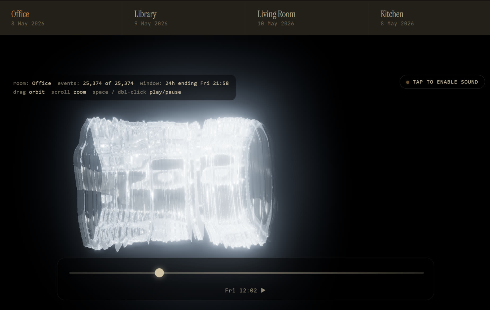
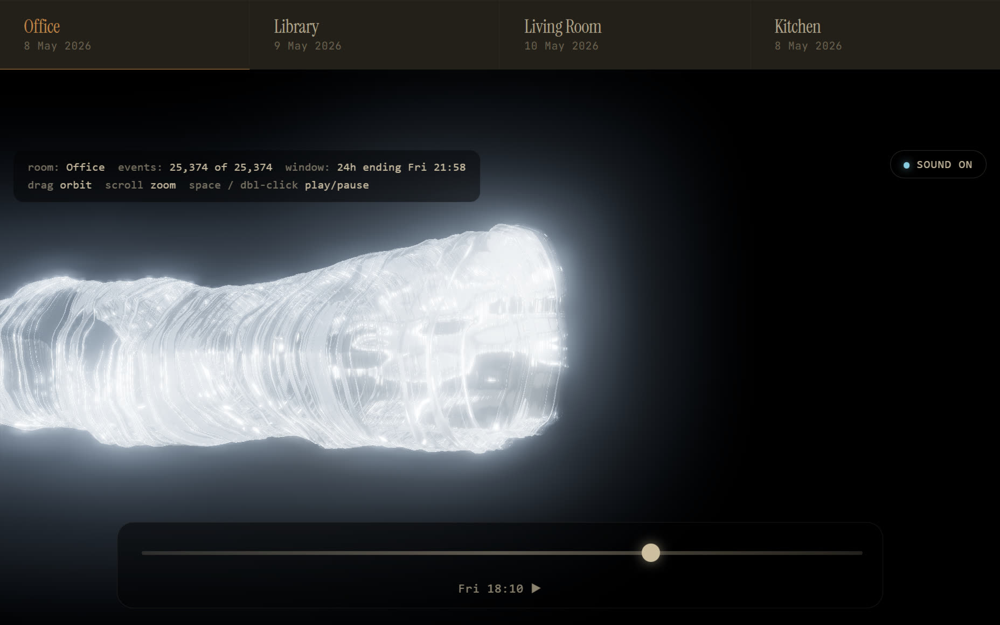

# Results — what success looks like

Captured 11 May 2026 against the bundled sample dataset (one anonymous office day, 25,374 decimated radar events, 24-hour window).

## Stills

### Front-facing (cursor at 12:02)



Cursor at midday. The membrane is symmetrical, vertical-axis dominant; you can read the morning's busy passages on the lower half and the afternoon's still-to-come surface above the cursor line.

### Side-on (cursor at 18:10)



Cursor at early evening. Side-on framing reveals the worm's full length and the bright leading edge where the cursor is currently writing the day.

## Capture

A thirty-second screen capture showing the cursor sweeping through the day, with audio enabled. Pentatonic chimes fire as the cursor crosses each thirty-second activity bin.

📼 [`docs/img/long-take-capture.mp4`](img/long-take-capture.mp4) — 30 sec, 1844×1168, ~6.6 MB.

(GitHub renders this as a download link in markdown. To view inline, clone the repo and open the file in any video player, or visit the live renderer at [haroldathome.com/the-long-take](https://haroldathome.com/the-long-take).)

## Reproducing these stills

If you want the same shots from your own data:

```sh
git clone https://github.com/alfiedennen/the-long-take
cd the-long-take
python -m http.server 8000
# browser → http://localhost:8000/examples/?r=office
# drag to orbit until you have the framing you want
# screenshot via OS shortcut
```

For the canonical visual journey across the 22 iterations and the design choices behind v22, see [haroldathome.com/the-long-take](https://haroldathome.com/the-long-take) — the website piece carries the visual story; this repo carries the runnable code.
